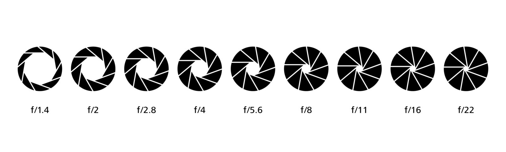
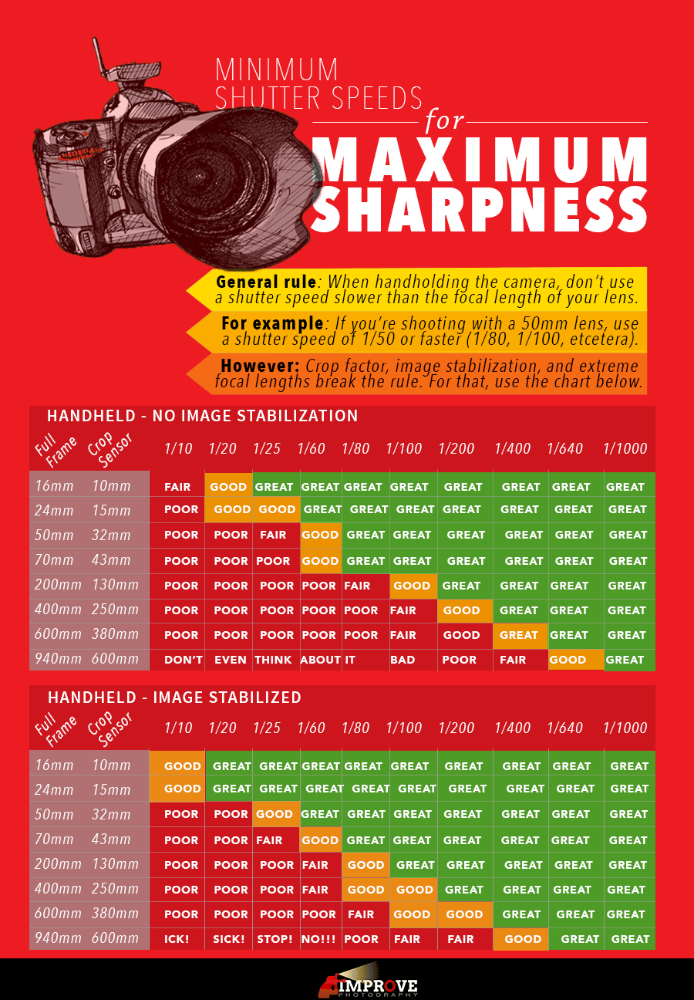

# Digital Photography Handbook

Exposure triangle
-----------------

Aperture
--------

**Aperture** is the diameter of the entrance pupil of the lens through which light travels into the camera.

	

### Depth of field

Shutter
-------

**Shutter speed** is the length of time the shutter is opened, exposing the camera sensor to light.

### Reciprocal rule

The rule states that the shutter speed needs to be at least the inverse of focal length. For example, if shooting with a **50mm** lens, then shutter speed should be at at least **1/50** to eliminate shake. If shooting with a **100mm** lens, then shutter speed should be at least **1/100**.

The reason being, the longer lens, the more exaggerated movement becomes when shooting handheld. Therefore, one need to shoot at faster shutter speeds in order to minimize movement so that the image doesn’t have any camera shake.

	

ISO
---

Shooting modes
--------------

| Name                 | Canon | Nikon | Aperture | Shutter | ISO     |
| -------------------- | ----- | ----- | -------- | ------- | ------- |
| Programmed automatic | P     | P     | CAMERA   | CAMERA  | **YOU** |
| Aperture priority    | Av    | A     | **YOU**  | CAMERA  | **YOU** |
| Shutter priority     | Tv    | S     | CAMERA   | **YOU** | **YOU** |
| Manual               | M     | M     | **YOU**  | **YOU** | **YOU** |

Focusing modes
----------------

| Name                     | Canon       | Nikon | Description                                                  |
| ------------------------ | ----------- | ----- | ------------------------------------------------------------ |
| One shot focusing mode   | One-Shot AF | AF-S  | In this mode, when you depress the shutter release halfway, the camera focuses on the subject just once – there’s no continuous adjustment |
| Continuous focusing mode | AI Servo AF | AF-C  | As soon as you begin to depress the shutter release, the camera goes into action and begins to focus. In Continuous focusing mode, the camera detects the subject’s movements and refocuses accordingly to keep the object sharp as a tack. |
| Automatic autofocus mode | AI Focus AF | AF-A  | In this mode, the camera’s focusing computer jumps back and forth between one shot and continuous focusing modes depending on the situation. This is the default autofocus mode on cameras that have this feature. |
| Manual focusing          |             |       | In this mode focus is adjusted manually using focus ring on the lens. |

Metering modes
--------------

Histogram
---------

Exposure compensation
---------------------