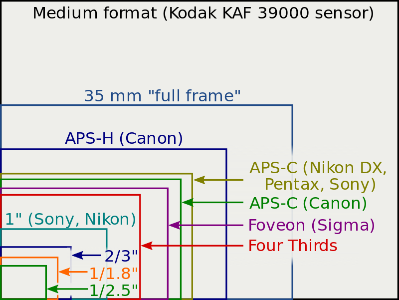
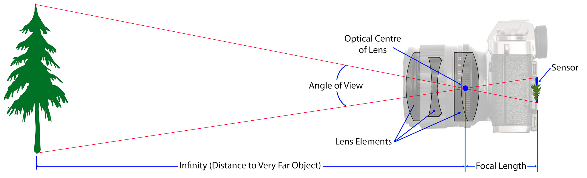

# Digital Photography Handbook

[TOC]

Image sensor formats
--------------------

	

| Type              | Aspect ratio | Width (mm) | Height (mm) | Diagonal (mm) | Crop factor |
| ----------------- | ------------ | ---------- | ----------- | ------------- | ----------- |
| 35MM (Full Frame) | 3:2          | 36         | 24          | 43,3          | 1,00        |
| APS-H             | 3:2          | 28,7       | 19          | 34,42         | 1,3         |
| APS-C             | 3:2          | 25,1       | 16,7        | 30,15         | 1,52        |
| 4/3               | 4:3          | 17,3       | 13          | 21,64         | 2,00        |

Big sensors:

- are performing better in low-light conditions

Small sensors:

- have wider depth of field

Exposure triangle
-----------------

Aperture
--------

**Aperture** is the diameter of the entrance pupil of the lens through which light travels into the camera. Aperture is also called **f-stop** or **f-number**. Range of f-numbers depends on the lens you use.

	

Small number = large hole (a lot of light is passing)
Big number = small hole (small amount of light is passing)

### Depth of field

Aperture size controls the **depth of field**:

| f-number                                  | depth of field                                               |
| ----------------------------------------- | ------------------------------------------------------------ |
| narrow aperture = large f-number eg. f/22 | produce a greater depth of field, useful when you want front to back sharpness, for example in landscape work |
| wide aperture = small f-number eg. f/1.4  | have the shallowest depth of field and can be used for creative effect, for example in portraits - subject stands out as sharply as possible against a blurred background |

Shutter
-------

**Shutter speed** is the length of time the shutter is opened, exposing the camera sensor to light.

### Reciprocal rule

The rule states that the shutter speed needs to be at least the inverse of focal length. For example, if shooting with a **50mm** lens, then shutter speed should be at at least **1/50** to eliminate shake. If shooting with a **100mm** lens, then shutter speed should be at least **1/100**.

The reason being, the longer lens, the more exaggerated movement becomes when shooting handheld. Therefore, one need to shoot at faster shutter speeds in order to minimize movement so that the image doesn’t have any camera shake.

	

Lenses
------

### Focal length

Focal length, usually represented in millimeters (mm), is the basic description of a photographic lens. It is not a measurement of the actual length of a lens, but a calculation of an optical distance from the point where light rays converge to form a sharp image of an object to the digital sensor or 35mm film at the focal plane in the camera. The focal length of a lens is determined when the lens is focused at infinity.

Lens focal length tells us the **angle of view** - how much of the scene will be captured and the **magnification** - how large individual elements will be. The longer the focal length, the narrower the angle of view and the higher the magnification. The shorter the focal length, the wider the angle of view and the lower the magnification.

	

### Lens classifications

| Type       | Description                | Benefits                                                     |
| ---------- | -------------------------- | ------------------------------------------------------------ |
| prime lens | have a fixed focal length  | Prime lenses tend to be more compact and lightweight than zoom lenses. Prime lenses also tend to have a larger maximum aperture (f/1.4 to f/2.8). This is an advantage when shooting in low light conditions as it will increase the possibility of hand holding the camera and freezing the subject without shake or blur caused by the longer exposures. Photographing using prime lenses with large apertures also means you can get a shallow depth of field which is useful for portraiture where you might want a bokeh. |
| zoom lens  | have variable focal length | The advantage of a zoom lens is versatility. They are ideal when you are photographing a variety of subjects such as landscapes and portraits, and you just want one lens for both situations. Using a zoom lens also reduces the number of times you need to change the lens which saves time and limits the possibility of getting dust in the camera's mirror box or on the sensor. |

### Lens speed (f-stop number)

Lens speed refers to the amount of light that travels through the lens while the shutter is open. A lens’ speed is usually referred to by the size of the maximum aperture of the lens. This diameter is expressed as an f-number, such as f/2.8 or f/5.6.

Example:  going from say f/4 to f/5.6 (or "stopping down one stop") means that only half as much light will be used to expose the images. To get the same exposure with an aperture of f/5. 6 you need to use a slower shutter speed than you would at f/4 to let in the same amount of light. So an f/4 lens is "faster" than an f/5.6 lens.

ISO
---

Shooting modes
--------------

| Name                 | Canon | Nikon | Aperture | Shutter | ISO     |
| -------------------- | ----- | ----- | -------- | ------- | ------- |
| Programmed automatic | P     | P     | CAMERA   | CAMERA  | **YOU** |
| Aperture priority    | Av    | A     | **YOU**  | CAMERA  | **YOU** |
| Shutter priority     | Tv    | S     | CAMERA   | **YOU** | **YOU** |
| Manual               | M     | M     | **YOU**  | **YOU** | **YOU** |

Focusing modes
----------------

| Name                     | Canon       | Nikon | Description                                                  |
| ------------------------ | ----------- | ----- | ------------------------------------------------------------ |
| One shot focusing mode   | One-Shot AF | AF-S  | In this mode, when you depress the shutter release halfway, the camera focuses on the subject just once – there’s no continuous adjustment |
| Continuous focusing mode | AI Servo AF | AF-C  | As soon as you begin to depress the shutter release, the camera goes into action and begins to focus. In Continuous focusing mode, the camera detects the subject’s movements and refocuses accordingly to keep the object sharp as a tack. |
| Automatic autofocus mode | AI Focus AF | AF-A  | In this mode, the camera’s focusing computer jumps back and forth between one shot and continuous focusing modes depending on the situation. This is the default autofocus mode on cameras that have this feature. |
| Manual focusing          |             |       | In this mode focus is adjusted manually using focus ring on the lens. |

Metering modes
--------------

Histogram
---------

Exposure compensation
---------------------

How to set diopter?
-------------------

1. Put lens cap on
2. Push shutter button half-way
3. Adjust for the sharpest display of exposure settings display in the viewfinder